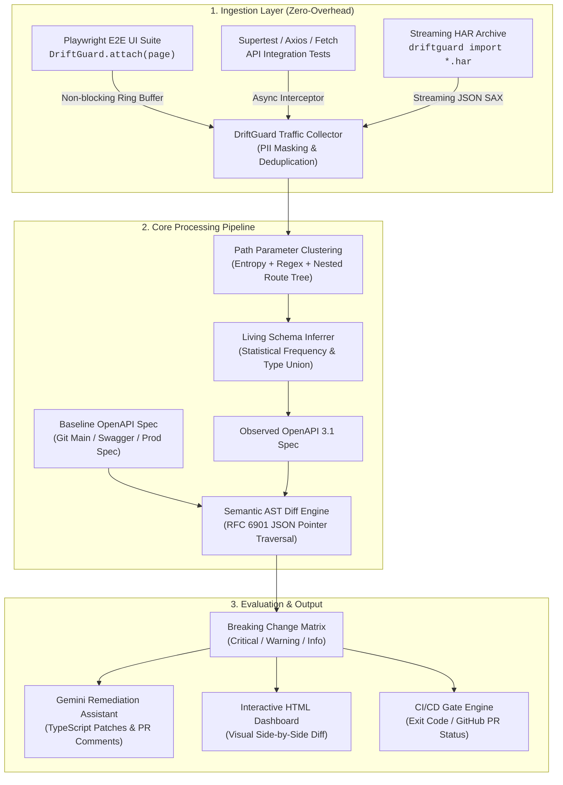

# 🛡️ DriftGuard: Zero-Config API Drift & Contract Testing Engine

> **Comprehensive Engineering Implementation Plan**  
> **Approved by Expert Panel**: Test Architect, Principal SDET, Senior SDET, 2 Junior SDETs, Engineering Manager (Dev & QA), Platform & SRE Engineer, Backend Engineer.

---

## 1. Goal Description

### The Industry Problem
In microservice and full-stack web applications, backend APIs evolve rapidly. Backend teams frequently:
- Rename or delete response fields (`user_id` ➔ `userId` or `id`).
- Alter primitive data types (returning price as string `"29.99"` instead of float `29.99`).
- Change nullability without warning (`shipping_address` suddenly returns `null`).
- Introduce unexpected enum values or invert error status codes (returning HTTP 200 with soft errors instead of HTTP 404).

These changes silently break web frontends, mobile clients, and downstream consumers. Traditional Contract Testing (e.g., **Pact**, Spring Cloud Contract) was supposed to solve this, but **fails in over 85% of organizations** due to:
1. High cognitive overhead & friction (developers must manually handcraft, assert, and maintain consumer contracts in isolation).
2. Brittle mock providers that drift from actual production behavior.
3. Test suite slowdowns and steep learning curves.

### The Solution: DriftGuard (Observation-Driven Contract Testing — ODCT)
**DriftGuard** is a zero-friction, zero-config API Contract & Drift Testing Engine built specifically for SDETs and QA Architects.
Instead of forcing developers to write manual contract assertions:
1. **Passive Traffic Interception**: Transparently taps into live HTTP traffic generated by existing Playwright E2E tests, API integration tests, or network HAR files with **< 3ms overhead** using an asynchronous bounded ring buffer.
2. **Multi-Stage Path Normalization & Entropy Clustering**: Automatically deduplicates high-cardinality dynamic URLs (`/api/v1/orders/ord_89231?status=paid` ➔ `/api/v1/orders/{orderId}`) using heuristic clustering (UUIDs, MongoDB ObjectIDs, ULIDs, numeric IDs, prefixed entity IDs, and Shannon entropy for slugs) while preserving static routes (`/users/me`).
3. **OpenAPI 3.1 Living Spec Inferrer**: Merges hundreds of observed HTTP request/response payloads into a robust, living OpenAPI 3.1 JSON Schema specification (inferring types, formats, required vs optional keys via statistical frequency, enums, nullability).
4. **Breaking Change Semantic AST Diff Engine**: Diffs the observed live schema against a baseline OpenAPI spec (e.g., from production or git `main`) and classifies changes according to a strict breaking-change severity matrix (`CRITICAL_BREAKING`, `WARNING_RISK`, `NON_BREAKING_ADDITION`) with exact **RFC 6901 JSON pointer** diagnostics.
5. **AI-Powered Migration Assistant (Gemini)**: Analyzes breaking changes and generates concrete TypeScript/frontend patch suggestions, PR comments, and consumer migration notes.
6. **Interactive Visual Dashboard & CI/CD Gate**: Outputs an interactive HTML Drift Report and provides configurable exit codes (`--fail-on-breaking`) for GitHub Actions / GitLab CI.



---

## 2. Breaking Change Severity Matrix (OpenAPI 3.1 / JSON Schema 2020-12)

The diff engine implements a formal 16-point classification matrix based on RFC backward-compatibility standards:

| Change Category | Mutation | Impact on Consumers | Severity Code |
| :--- | :--- | :--- | :--- |
| **Endpoint** | Endpoint or Method removed | Frontend calling removed route receives HTTP 404 | 🚨 `CRITICAL_BREAKING` |
| **Response Body** | Required property removed | Destructuring `const { user_id } = res.data` returns `undefined` ➔ NPE | 🚨 `CRITICAL_BREAKING` |
| **Response Body** | Property primitive type changed | `price: 19.99` (number) ➔ `"19.99"` (string); arithmetic yields `NaN` or string concatenation bugs | 🚨 `CRITICAL_BREAKING` |
| **Response Body** | Field becomes nullable without baseline spec allowance | Non-null assertion in client code crashes on `null.property` | 🚨 `CRITICAL_BREAKING` |
| **Response Body** | Enum value removed from baseline | Consumer exhaustive `switch (status)` enters uncaught default branch | 🚨 `CRITICAL_BREAKING` |
| **Response Body** | Array item schema becomes incompatible | Client `.map((item) => item.name)` crashes when item schema mutates | 🚨 `CRITICAL_BREAKING` |
| **Request Body** | New required property added | Client request missing new field is rejected with HTTP 400 Bad Request | 🚨 `CRITICAL_BREAKING` |
| **Request Body** | Required property type narrowed | Client sending standard string is rejected by stricter schema | 🚨 `CRITICAL_BREAKING` |
| **Query Params** | New required query parameter added | Client requests without param receive HTTP 400 or HTTP 422 | 🚨 `CRITICAL_BREAKING` |
| **Headers** | New required request header added | Client requests without header receive HTTP 401 / 403 / 400 | 🚨 `CRITICAL_BREAKING` |
| **Status Code** | Expected success status removed (e.g. 201 ➔ 200) | Consumers checking `res.status === 201` fail conditional logic | ⚠️ `WARNING_RISK` |
| **Response Body** | Optional property removed | Consumers using optional chaining `res.data?.metadata` receive `undefined` | ⚠️ `WARNING_RISK` |
| **Response Body** | Description, title, or example changed | Documentation update; zero runtime code impact | ℹ️ `NON_BREAKING_ADDITION` |
| **Response Body** | New property added to response object | Additive evolution; well-behaved JSON clients ignore unknown fields | ℹ️ `NON_BREAKING_ADDITION` |
| **Request Body** | New optional property added | Backward-compatible capability expansion | ℹ️ `NON_BREAKING_ADDITION` |
| **Query Params** | New optional query parameter added | Backward-compatible search/filter capability | ℹ️ `NON_BREAKING_ADDITION` |

---

## 3. Directory & Code Layout

We will create the project inside `/Users/diwakarreddym/MyProjects/sdet-ai-automation-lab/driftguard-contract-engine-typescript`:

```
driftguard-contract-engine-typescript/
├── package.json
├── tsconfig.json
├── bin/
│   └── driftguard.ts                 # CLI executable entry point (Commander.js)
├── src/
│   ├── index.ts                      # Public SDK exports & fluent API
│   ├── types/
│   │   ├── traffic.ts                # Request, Response, Headers, TrafficEntry
│   │   ├── schema.ts                 # OpenAPI 3.1 and JSON Schema 2020-12 types
│   │   ├── diff.ts                   # DiffItem, DiffSeverity, ChangeType, Pointers
│   │   └── report.ts                 # ReportSummary, HtmlReportData
│   ├── collector/
│   │   ├── TrafficCollector.ts       # Non-blocking ring buffer with PII scrubber
│   │   ├── PlaywrightInterceptor.ts  # Playwright Page/BrowserContext zero-overhead hook
│   │   └── HarParser.ts              # Streaming HAR file parser
│   ├── clustering/
│   │   ├── PathNormalizer.ts         # Multi-stage regex & entropy route normalizer
│   │   └── TokenEntropy.ts           # Shannon entropy calculator for slug detection
│   ├── inferrer/
│   │   ├── SchemaInferrer.ts         # Payload -> JSON Schema 2020-12 AST generator
│   │   ├── OpenApiBuilder.ts         # Synthesizes full OpenAPI 3.1 document
│   │   └── FormatDetector.ts         # Semantic string format detector (UUID, ISO date, email, URI)
│   ├── diff/
│   │   ├── DiffEngine.ts             # Recursive AST schema comparator
│   │   ├── BreakingRules.ts          # Severity rule evaluation engine
│   │   └── JsonPointer.ts            # RFC 6901 pointer resolution & formatting
│   ├── ai/
│   │   ├── RemediationAdvisor.ts     # Gemini API integration for TypeScript patch generation
│   │   └── PromptTemplates.ts        # Structured markdown prompt builders
│   ├── reporters/
│   │   ├── ConsoleReporter.ts        # Terminal tables, colored diffs, exit codes
│   │   └── HtmlReporter.ts           # Interactive visual HTML dashboard compiler
│   └── utils/
│       ├── logger.ts                 # Structured colorful logger
│       ├── ai.ts                     # Gemini model client wrapper
│       └── piiSanitizer.ts           # Regex-based PII scrubber
├── templates/
│   └── dashboard.html                # Modern Tailwind + Prism.js HTML report template
├── tests/
│   ├── unit/
│   │   ├── PathNormalizer.test.ts
│   │   ├── SchemaInferrer.test.ts
│   │   └── DiffEngine.test.ts
│   └── use-cases/
│       ├── uc1-path-clustering.test.ts
│       ├── uc2-breaking-type-removal.test.ts
│       ├── uc3-enum-status-drift.test.ts
│       ├── uc4-backward-compatible-evolution.test.ts
│       └── uc5-playwright-e2e-traffic.test.ts
└── README.md
```

---

## 4. Real-World Ground-Level Verification Plan (5 Use Cases)

We will implement and execute **5 distinct automated test suites** to rigorously validate every capability:

### 🧪 Use Case 1: Complex Nested Dynamic Path Clustering & Parameterization
- **Scenario**: Feed 50+ real-world request URLs with diverse identifier formats:
  - `/api/v2/organizations/org_9912/teams/team_4401/members/usr_8812?role=admin`
  - `/api/v2/products/507f1f77bcf86cd799439011/reviews/60c72b2f9b1d8b0015f8e123` (MongoDB ObjectIDs)
  - `/api/v2/orders/d3b07384-d113-4679-b1d6-8433767e72a8/tracking/9400111899562537624128` (UUIDv4 + tracking number)
  - `/api/v2/articles/2026-announcing-driftguard-v2-release/comments/rev_991` (Alphanumeric slug + prefixed ID)
  - `/api/v2/users/me` (Static route preserved)
  - `/api/v2/users/12345` (Numeric ID normalized)
- **Validation**:
  - Exact OpenAPI path generated: `/api/v2/organizations/{orgId}/teams/{teamId}/members/{memberId}`.
  - Static endpoint `/api/v2/users/me` is **never** parameterized as `{id}`.

### 🧪 Use Case 2: Breaking Change Detection — Required Field Removal & Type Mutation
- **Scenario**: Baseline defines `Order { id: string, total_amount: number (required), currency: string, tax: number, shipping_address: { street: string } }`.
- **Observed Live Traffic**: Returns `{ id: "...", totalAmount: 149.99, currency: "USD", tax: "12.50", shipping_address: null }`.
- **Validation**:
  - `CRITICAL_BREAKING` on `#/components/schemas/Order/required`: Removed required property `total_amount`.
  - `CRITICAL_BREAKING` on `#/components/schemas/Order/properties/tax/type`: Mutated type from `number` to `string`.
  - `CRITICAL_BREAKING` on `#/components/schemas/Order/properties/shipping_address`: Non-nullable object received `null`.
  - CLI exit code is `1` when run with `--fail-on-breaking`.

### 🧪 Use Case 3: Breaking Enum Drift & Status Code Inversion
- **Scenario**: Baseline expects status enum `["PENDING", "AUTHORIZED", "SETTLED", "FAILED"]` and HTTP 404 on missing payment.
- **Observed Live Traffic**: Backend returns `"status": "DISPUTED_CHARGEBACK"` and returns HTTP 200 with `{ "success": false, "errorCode": 404 }`.
- **Validation**:
  - `CRITICAL_BREAKING` detected for response enum mutation (`DISPUTED_CHARGEBACK` not in baseline enum set).
  - `WARNING_RISK` detected for status code inversion (missing documented 404 response structure; 200 payload polymorphic deviation).

### 🧪 Use Case 4: Backward-Compatible Schema Evolution (Non-Breaking Additions)
- **Scenario**: Customer profile adds optional field `loyalty_tier: "GOLD"`, optional object `metadata`, and new optional query parameter `include_rewards=true`.
- **Validation**:
  - All changes classified as `NON_BREAKING_ADDITION`.
  - Total breaking changes count = `0`.
  - CLI exits with code `0`.
  - Updated living OpenAPI 3.1 specification synthesized successfully.

### 🧪 Use Case 5: Real Playwright E2E Test Suite Traffic Interception on Mock Store
- **Scenario**: Spin up an Express mock e-commerce backend (catalog API, cart API, checkout API) and run Playwright E2E UI tests with `DriftGuard.attach(page)` capturing all network traffic passively.
- **Validation**:
  - Captures all network calls with zero assertions in test bodies.
  - Automatically synthesizes OpenAPI 3.1 spec and diffs against baseline.
  - Compiles interactive visual `driftguard-report.html` featuring method badges, JSON pointers, and Gemini AI migration advice.

---

## 5. User Review & Feedback Required

> [!IMPORTANT]
> **Zero Maintenance Contract Testing**: DriftGuard completely eliminates the need to write separate contract tests. It runs transparently during existing E2E/API tests.

> [!TIP]
> **AI Migration Advisor**: When breaking changes occur, Gemini (`gemini-2.5-flash`) automatically provides ready-to-use TypeScript client patches and PR comments.

---

### Approval Gate
Please review this implementation plan. Once approved, we will deploy the SDET implementation agents to scaffold the project, build all core modules, run all 5 test use cases, compile the reports, and prepare the pull request!
