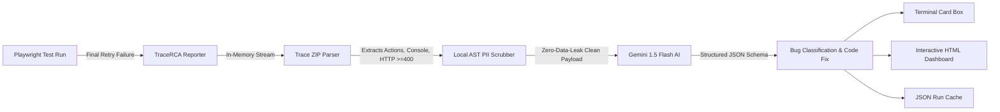

# ⚡ TraceRCA: Playwright Trace AI Triage & Flaky Test Analyzer

> **Stop spelunking through 80MB Playwright traces. TraceRCA programmatically extracts trace AST telemetry, scrubs sensitive PII/secrets locally, and uses Google Gemini with strict structured outputs to classify failures into App Bug, Test Bug, or Infra Flake with instant code fixes.**

[](https://www.typescriptlang.org/)
[](https://playwright.dev/)
[](https://deepmind.google/technologies/gemini/)
[](./tracerca.config.json)
[-brightgreen.svg)](./TEST_RESULTS.md)
[](./package.json)

---

## 🛑 The Real-World Dilemma: The Silent CI Killer

Every modern engineering organization eventually runs into the same painful reality: **flaky end-to-end tests and opaque CI failures destroy engineering velocity**.

It is 5:15 PM on release day. A pull request is ready to merge, but the CI pipeline turns red on `checkout-flow.spec.ts`. 

- *Is it a genuine regression introduced in the backend orders microservice?*
- *Is it an outdated DOM selector because a frontend developer renamed a button class?*
- *Or is it a transient network gateway timeout on third-party payment infrastructure?*

When test failure causes are unknown, **trust in automated testing completely evaporates**. Developers rerun pipelines 3 to 5 times hoping for a green run. PRs stall, releases are delayed, and thousands of engineering hours are lost to debugging ghost failures.

---

## ⚖️ The Two Bad Choices Teams Settle For Today

```
                               THE STATUS QUO
                                     │
         ┌───────────────────────────┴───────────────────────────┐
         ▼                                                       ▼
  [BAD CHOICE #1]                                         [BAD CHOICE #2]
The Blind Retry Anti-Pattern                            Manual Trace Spelunking
• Adds retries: 3 in CI config                          • Downloads 80MB trace.zip from CI
• Masking real production race conditions               • Opens Playwright Trace Viewer GUI
• Triples CI execution minutes & costs                  • Manually correlates 500+ network calls
• Real bugs slip into production unnoticed              • Wastes 45+ minutes per developer/day
```

1. **Choice 1: The "Blind Retry" Anti-Pattern**  
   Teams configure `retries: 3` in their CI matrix. While this temporarily turns PR checkmarks green, it silently sweeps critical race conditions, database deadlocks, and memory leaks under the rug. Over time, test suites bloat, CI execution bills skyrocket, and flaky tests metastasize.

2. **Choice 2: The "Manual Trace Spelunking" Tax**  
   Engineers are forced to download massive 80MB `trace.zip` artifacts, boot up the local Playwright Trace Viewer GUI, and manually step through hundreds of DOM actions, network requests, and console messages. By the time the developer isolates the failing API status code or detached DOM element, 45 minutes of deep-focus engineering time has been burned.

---

## 💡 The TraceRCA Solution: Automated, Sanitized AI Triage

**TraceRCA** bridges the gap between raw test execution telemetry and actionable engineering resolutions. It runs as a native **Playwright Custom Reporter** and **CLI Toolkit** that does the heavy lifting instantly:



### 🔑 Key Capabilities

1. **⚡ In-Memory Trace ZIP Ingestion & Bottleneck Profiling**  
   Reads and parses `trace.playwright-trace`, `trace.network`, and SHA-1 resource bodies directly in memory in **under 35ms**, without spinning up heavy browser rendering engines in CI. Profiles action execution duration to pinpoint latency bottlenecks.

2. **🛡️ Zero-Data-Leak Local PII & Secret Sanitization**  
   Runs local recursive AST JSON traversal and configurable regex scrubbing *before* any payload leaves your infrastructure. Redacts `Authorization` headers, cookies, API keys, passwords, credit card numbers, emails, and SSNs.

3. **🧠 Deterministic AI Triage via Strict Schema Output**  
   Utilizes Gemini's native structured JSON schema enforcement (`responseSchema`) to categorize failures deterministically into:
   - **`App Bug`**: Backend 500 crashes, unhandled server exceptions, database deadlocks.
   - **`Test Bug`**: Selector DOM drift, missing `toBeVisible()` assertions, race conditions.
   - **`Infra Flake`**: Gateway 504 timeouts, proxy connection resets, container resource starvation.

4. **💰 Smart Final-Retry Filtering & CI Cost Controls**  
   Absorbs transient intermediate retries (e.g. ignores retry 0 and retry 1) and **only triggers AI analysis on the final retry failure**. Strictly enforces `maxAnalyses` caps (default: 5) to protect API budgets during widespread infrastructure outages.

5. **📊 Historical Transition-Based Flakiness Scoring**  
   Aggregates multi-run JUnit XML and Playwright JSON reports to calculate flip rates ($0\%$ to $100\%$) across historical test runs, categorizing test suites into clear reliability tiers with visual status glyph histories (`✓✗✓○!`).

---

## 👥 Target Audience & Value Matrix

| Role | Pain Point Solved | TraceRCA Value Add | Typical Time Saved |
| :--- | :--- | :--- | :--- |
| **Lead SDET & QA Architect** | Constantly blamed for "unreliable test suites" and triaging hundreds of failed runs manually. | Instant failure classification (App vs Test vs Infra) with root-cause reports generated directly into CI logs. | **4–6 hours / week** |
| **Fullstack / Backend Developer** | Wasting time debugging whether a CI red build is their code change or a flaky third-party test. | Pinpointed failing API endpoint, HTTP payload snippet, and suggested fix directly on the PR. | **30 min / failure** |
| **DevOps / Platform Engineer** | Skyrocketing CI minutes caused by blind retries (`retries: 3`) and large trace artifact storage. | Eliminates unnecessary retries; extracts lightweight trace telemetry in memory (< 50KB JSON). | **35% CI cost reduction** |
| **Engineering Director / VP** | Inability to measure test suite health and engineering release confidence. | Transition-based flakiness scoring across test runs and self-contained executive HTML dashboards. | **High Release Confidence** |

---

## 📦 Project Architecture

```
flaky-test-analyzer-typescript/
├── src/
│   ├── index.ts                      # CLI router (analyze, report, formats, tracerca)
│   ├── types.ts                      # Core diagnostic interfaces & schemas
│   ├── analyzer.ts                   # Transition-based flakiness scoring engine
│   ├── playwright-reporter.ts        # Playwright custom reporter with retry filtering
│   ├── parsers/                      # Parsers: JUnit XML, Jest JSON, Playwright ZIP
│   │   ├── index.ts                  # Auto-detect parser orchestrator
│   │   ├── junit.ts                  # JUnit / xUnit XML parser
│   │   ├── jest.ts                   # Jest JSON reporter parser
│   │   ├── playwright.ts             # Playwright JSON report parser
│   │   └── trace.ts                  # Programmatic trace.zip stream extractor
│   ├── sanitization/                 # AST JSON scrubber & regex masking engine
│   │   └── scrubber.ts               # Zero-data-leak redactor
│   ├── ai/                           # Gemini 1.5 Flash client & prompt compiler
│   │   └── client.ts                 # Structured prompt & JSON schema invoker
│   └── reporters/                    # Reporting surfaces
│       ├── console.ts                # Terminal cards with chalk
│       ├── json.ts                   # Machine-readable JSON output
│       └── html.ts                   # Interactive Tailwind/JetBrains HTML dashboard
├── tests/                            # Automated Use Case Test Suites
│   ├── framework/test-runner.ts      # Zero-dependency typed test framework
│   ├── use-cases/                    # 5 Rigorous Use Case Suites (UC-1 to UC-5)
│   └── run-all.ts                    # Master test runner
├── samples/                          # Sample multi-run JUnit XML fixtures
├── tracerca.config.json              # Local PII masking rules & CI cost limits
├── TEST_RESULTS.md                   # Comprehensive test verification breakdown
├── package.json                      # Scripts & dependencies
└── tsconfig.json                     # TypeScript compiler configuration
```

---

## 🚀 Quick Start Guide

### 1. Installation

```bash
# Clone the repository
git clone https://github.com/diwakarreddym/flaky-test-analyzer-typescript.git
cd flaky-test-analyzer-typescript

# Install dependencies and build
npm install
npm run build
```

### 2. Configure Environment & PII Rules

Export your Gemini API Key:
```bash
export GEMINI_API_KEY="your-gemini-api-key-here"
```

Customize your local PII redactor in `tracerca.config.json`:
```json
{
  "sanitization": {
    "maskValue": "[REDACTED_BY_TRACERCA]",
    "sensitiveHeaders": ["authorization", "cookie", "x-api-key"],
    "sensitiveKeys": ["password", "token", "creditcard", "email", "ssn", "cvv"]
  },
  "analysis": {
    "maxAnalyses": 5
  }
}
```

### 3. Register Custom Playwright Reporter

Add TraceRCA to your `playwright.config.ts`:
```typescript
import { defineConfig } from '@playwright/test';

export default defineConfig({
  retries: 2, // TraceRCA will only triage if it fails all 2 retries
  reporter: [
    ['list'],
    ['./dist/playwright-reporter'] // TraceRCA Custom Reporter
  ],
  use: {
    trace: 'retain-on-failure', // Captures trace.zip on failure
  }
});
```

---

## 🖥️ CLI Commands

### 🔍 Command 1: `flaky tracerca analyze` (AI Trace Triage)
Programmatically inspect trace files, scrub secrets, and run AI root-cause analysis:
```bash
# Analyze trace zip archives and cache results
npx flaky tracerca analyze "test-results/**/*.zip" --max-analyses 5
```

### 📊 Command 2: `flaky tracerca report` (HTML Dashboard)
Generate the dark-themed interactive HTML dashboard from cached test run analyses:
```bash
# Exports 'tracerca-report.html' from the most recent run
npx flaky tracerca report -o tracerca-dashboard.html
```

### 📈 Command 3: `flaky analyze` (Historical Flakiness Scoring)
Compute status transition flip rates across historical JUnit / Playwright JSON runs:
```bash
# Analyze test results across multiple runs
npx flaky analyze "samples/run*-junit.xml" --threshold 15 --min-runs 2
```

---

## 🧪 Rigorous Test Suite Verification (100% Pass Rate)

TraceRCA is thoroughly verified with **24 automated use case test cases and 110+ assertions** across 5 distinct domains:

- **UC-1: Historical Flakiness Scoring & Severity Tiering** (Flip rate transitions, skipped run absorption, ranking).
- **UC-2: Playwright Trace ZIP Ingestion & Profiling** (In-memory NDJSON parsing, failed action isolation, bottleneck profiling).
- **UC-3: Zero-Data-Leak PII Scrubbing** (Headers, URLs, AST JSON recursive masking, unstructured text regexes).
- **UC-4: Playwright Reporter & Retry Filtering** (Pass/skip ignore, intermediate retry absorption, final retry trigger).
- **UC-5: Gemini Triage & HTML Dashboard Export** (Structured prompt formatting, App/Test/Infra classification, Tailwind HTML generation).

👉 **[Read the Full Test Execution Report in TEST_RESULTS.md](./TEST_RESULTS.md)**

```bash
# Run all 5 automated test suites
npm test
```

---

## 📄 License

Distributed under the **MIT License**. See [LICENSE](./package.json) for details.
