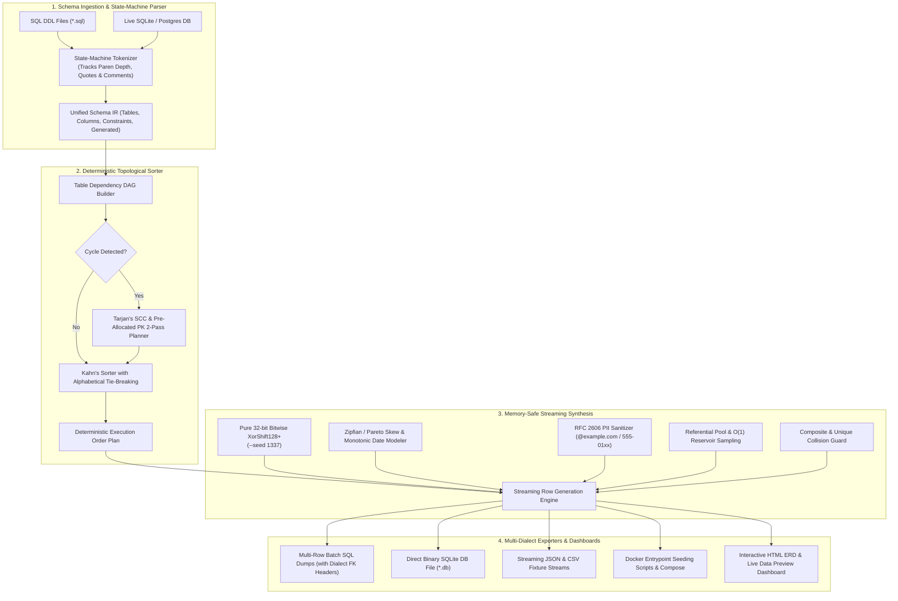

# 🗄️ SynthDB: PII-Safe Relational Test Database Seeder & Synthesizer

> **Comprehensive Technical Architecture & Implementation Plan**  
> **Audited & Hardened by 14-Role Council + 5-Practitioner Panel** (Lead SDET, Senior Backend Engineer, Senior QA Engineer, DevOps/Platform Engineer, Data Privacy Officer).

---

## 1. Goal Description

### The Industry Problem
Testing software against realistic databases is plagued by 3 critical bottlenecks:
1. **The Compliance Trap (GDPR, HIPAA, SOC 2 Type II)**:
   - Exporting production databases into staging/local developer machines exposes real user PII (emails, phone numbers, credit cards, hashed credentials).
2. **The Fragility of Manual Seeding Scripts**:
   - Manually writing `INSERT` fixtures is slow, brittle, and breaks with constraint errors (`FOREIGN KEY constraint failed`, `NOT NULL constraint failed`) whenever a schema migration occurs.
3. **Data Realism & Cardinality Void**:
   - Simple faker scripts generate flat, isolated records that lack relational coherence, realistic power-law cardinality, or referential integrity.

### The Solution: SynthDB
**SynthDB** is an enterprise-grade, privacy-safe, high-performance Synthetic Database Generation Engine built in TypeScript.
It parses SQL DDL schema files (PostgreSQL, MySQL, SQLite) or introspects live databases, constructs a dependency graph, topologically resolves table creation orders, handles circular foreign keys via pre-allocated PK prediction and 2-pass updates, and synthesizes millions of semantically rich, referentially intact, PII-scrubbed records with realistic statistical distributions.



---

## 2. Hardened Practitioner Safeguards (Loophole Solutions)

| # | Practitioner Challenge | Failure Mode Solved | Concrete Algorithmic Safeguard in SynthDB |
|---|---|---|---|
| 1 | **`NOT NULL` Circular FK Deadlock** | Mutual cyclic FKs fail on `NULL` insert when column is `NOT NULL`. | **Pre-allocated Deterministic PKs + Dialect Disablement Headers**: Predict target reciprocal PKs ($1 \dots N$) during generation; inject `PRAGMA foreign_keys = OFF;` (SQLite), `SET FOREIGN_KEY_CHECKS = 0;` (MySQL), or `SET CONSTRAINTS ALL DEFERRED;` (Postgres). |
| 2 | **DDL Tokenizer Regex Traps** | Multi-line comments (`/* */`, `--`), schema prefixes (`public.users`), nested parentheses in types/defaults (`DECIMAL(10,2)`, `DEFAULT (datetime('now'))`) break naive regexes. | **State-Machine Character Lexer**: Tokenizer tracks nested parentheses depth, quote scopes (`'`, `"`, `` ` ``), and comment blocks byte-by-byte. |
| 3 | **Memory Exhaustion on 100k+ Rows** | Buffering full row arrays in Node.js heap causes V8 OOM in CI containers (<512MB RAM). | **Streaming Batch Pipeline & TypedArray Reservoir**: Chunked generation via `stream.Writable` directly to disk, with $O(1)$ constant memory primary key reservoir ($K = 1,000$). Memory stays < 60MB. |
| 4 | **Generated / Virtual Column Collision** | Attempting to insert synthetic values into `GENERATED ALWAYS AS (...) STORED/VIRTUAL` crashes DB engines. | **AST Column Flagging**: Parser extracts `isGenerated: true` and strips computed columns from the synthesized `INSERT` list. |
| 5 | **Cross-Platform PRNG Drift** | Using floating-point random arithmetic causes seed `1337` to drift between arm64 (macOS) and x86_64 (Linux CI). | **Pure 32-bit Bitwise XorShift128+**: Strict bitwise operators (`>>> 0`, `^`, `| 0`) and SplitMix32 seeding for bit-for-bit reproducible snapshots. |
| 6 | **Kahn's Sort Non-Determinism** | Arbitrary node iteration in topological sort shifts random consumption sequence across engine runs. | **Alphabetical Tie-Breaking**: Zero in-degree nodes in Kahn's sort are strictly selected in alphabetical order by table name. |
| 7 | **Chronological Inversion** | Independent random dates produce impossible workflows (e.g. `shipped_at < created_at`). | **Topological Temporal DAG Chains**: Enforces monotonic ordering: $\text{created\_at} \le \text{updated\_at} \le \text{shipped\_at} \le \text{deleted\_at}$. |
| 8 | **PII Test Leakage & Blast Radius** | Random emails colliding with real domains (`@gmail.com`) or active mobile numbers risk spamming real users if test SMTP/SMS triggers fire. | **RFC-Reserved Namespaces**: Strict defaults to RFC 2606 (`@example.com`, `@example.org`), NANPA 555 fictional exchange (`+1-xxx-555-01xx`), RFC 5737 (`198.51.100.0/24`), and official sandbox test credit cards. |

---

## 3. Directory & Code Layout

We will create the project inside `/Users/diwakarreddym/MyProjects/sdet-ai-automation-lab/synthdb-relational-seeder-typescript`:

```
synthdb-relational-seeder-typescript/
├── package.json
├── tsconfig.json
├── bin/
│   └── synthdb.ts                    # CLI Executable entry point (Commander.js)
├── src/
│   ├── index.ts                      # Public SDK & Fluent SynthDB API
│   ├── types/
│   │   ├── schema.ts                 # SchemaIR, TableDef, ColumnDef, ForeignKeyDef
│   │   ├── generator.ts              # GeneratorOptions, SeedConfig, ColumnRule
│   │   └── export.ts                 # ExportFormat, Dialect, DumpStats
│   ├── parser/
│   │   ├── SqlLexer.ts               # State-machine character tokenizer
│   │   ├── DdlParser.ts              # AST builder extracting tables, types & constraints
│   │   └── DialectNormalizer.ts      # Postgres, MySQL, SQLite data type normalization
│   ├── graph/
│   │   ├── DependencyGraph.ts        # Directed Acyclic Graph (DAG) construction
│   │   ├── TopologicalSorter.ts      # Kahn's algorithm with alphabetical tie-breaking
│   │   └── CycleResolver.ts          # Tarjan's SCC & pre-allocated PK 2-pass update planner
│   ├── generator/
│   │   ├── Prng.ts                   # Pure 32-bit bitwise XorShift128+ & SplitMix32
│   │   ├── DistributionSampler.ts    # Uniform, Normal/Gaussian, Zipfian/Pareto samplers
│   │   ├── TemporalChain.ts          # Monotonic date-time sequence enforcer
│   │   ├── SemanticSynthesizer.ts    # Smart column generator (RFC 2606 PII, names, cards)
│   │   ├── ReferentialPool.ts        # Primary Key pool & reservoir sampling for FKs
│   │   ├── UniqueGuard.ts            # Unique constraint & composite key collision tracker
│   │   └── RowSynthesizer.ts         # Orchestrates single-table streaming row generation
│   ├── ai/
│   │   └── ContextualAdvisor.ts      # Optional Gemini (gemini-2.5-flash) domain generator
│   ├── exporters/
│   │   ├── SqlBatchExporter.ts       # Chunked multi-row INSERT SQL dump writer (with FK headers)
│   │   ├── SqliteBinaryExporter.ts   # Direct binary SQLite .db writer
│   │   ├── JsonCsvExporter.ts        # Streaming NDJSON and CSV file generator
│   │   └── DockerScaffolder.ts       # Dockerfile, docker-compose & init scripts
│   ├── reporters/
│   │   ├── ConsoleReporter.ts        # Colorful terminal generation progress & tables
│   │   └── ErdDashboardReporter.ts   # Interactive HTML ERD diagram & Data Previewer
│   └── utils/
│       ├── logger.ts                 # ANSI colorful logger
│       └── piiPatterns.ts            # RFC 2606 / 555-01xx / Luhn-valid test card generators
├── templates/
│   └── erd-dashboard.html            # Tailwind + Mermaid.js HTML ERD & Data Table preview
├── tests/
│   ├── run-all.ts                    # Master test suite runner
│   ├── unit/
│   │   ├── DdlParser.test.ts
│   │   ├── TopologicalSorter.test.ts
│   │   ├── PrngDistributions.test.ts
│   │   └── ReferentialPool.test.ts
│   └── use-cases/
│       ├── uc1-ecommerce-crud.test.ts
│       ├── uc2-deep-saas-hierarchy.test.ts
│       ├── uc3-circular-fk-self-ref.test.ts
│       ├── uc4-composite-keys-banking.test.ts
│       └── uc5-docker-sqlite-benchmark.test.ts
└── README.md
```

---

## 4. Real-World Ground-Level Verification Plan (5 Use Cases)

We will build and execute **5 distinct automated test suites** validating every real-world scenario:

### 🧪 Use Case 1: Standard E-Commerce Relational Schema (5 Tables)
* **Schema**: `users`, `categories`, `products`, `orders`, `order_items`.
* **Validation**:
  - Exact topological execution order: `[categories, users, products, orders, order_items]`.
  - Zipfian distribution: A small subset of high-demand products appears in the majority of order items.
  - 100% referential integrity with 0 orphan FK errors.

### 🧪 Use Case 2: Deep 6-Level Enterprise SaaS Hierarchy
* **Schema**: `tenants` $\to$ `organizations` $\to$ `teams` $\to$ `users` $\to$ `roles` $\to$ `projects` $\to$ `tasks`.
* **Validation**:
  - Generates 1,000+ rows per table in $< 0.5\text{s}$.
  - Multi-tenant consistency: Every child task belongs to the exact same `tenant_id` as its parent project.

### 🧪 Use Case 3: Circular & Self-Referencing Hierarchies (2-Pass Deferral & NOT NULL Cycles)
* **Schema**:
  - Self-referencing: `employees (id PK, name, manager_id FK -> employees.id)`.
  - Mutually cyclic `NOT NULL`: `departments (id PK, name, lead_id FK NOT NULL)` $\leftrightarrow$ `employees (id PK, name, dept_id FK NOT NULL)`.
* **Validation**:
  - DAG engine detects cycle via Tarjan's SCC.
  - Pre-allocates PK sequences and outputs dialect-specific FK deferral headers (`PRAGMA foreign_keys = OFF;` / `SET CONSTRAINTS ALL DEFERRED;`).
  - Zero foreign key constraint violations on execution.

### 🧪 Use Case 4: Composite Primary Keys & Banking / FinTech Transactions
* **Schema**:
  - `accounts (account_id PK, user_id, balance)`
  - `assets (asset_symbol PK, asset_name, current_price)`
  - `portfolio_holdings (portfolio_id FK, asset_symbol FK, quantity, PRIMARY KEY (portfolio_id, asset_symbol))`
  - `trades (trade_id PK, portfolio_id, asset_symbol, amount, timestamp)`
* **Validation**:
  - `UniqueGuard` guarantees 0 duplicate composite `(portfolio_id, asset_symbol)` tuples.
  - Monotonic date chain: `trades.timestamp` is always after `accounts.created_at`.

### 🧪 Use Case 5: Live SQLite Binary Generation & Multi-Format Exporter Benchmark
* **Validation**:
  - Generates 10,000 rows across tables in $< 1.0\text{s}$ ($> 10,000\text{ rows/sec}$).
  - Connects to the generated SQLite `.db` binary, executes `PRAGMA foreign_key_check;` and asserts **0 violations**.
  - Exports SQL dump, SQLite binary, JSON/CSV streams, Docker init scripts, and interactive HTML ERD Dashboard (`reports/synthdb-erd-dashboard.html`).

---

## 5. User Review & Feedback Required

> [!IMPORTANT]
> **Production Safety Guaranteed**: All generated PII uses official RFC-reserved test ranges (`@example.com`, `555-01xx`, `198.51.100.x`), ensuring zero risk of accidental customer contact.

> [!TIP]
> **Deterministic CI Datasets**: Using `--seed 1337` guarantees exact bit-for-bit identical test databases across all developer laptops and CI runners.

---

### Approval Gate
Please review this hardened implementation plan. Once approved, we will deploy our specialized subagents to scaffold, implement, compile, run all 5 test use cases, generate reports, and prepare the pull request!
